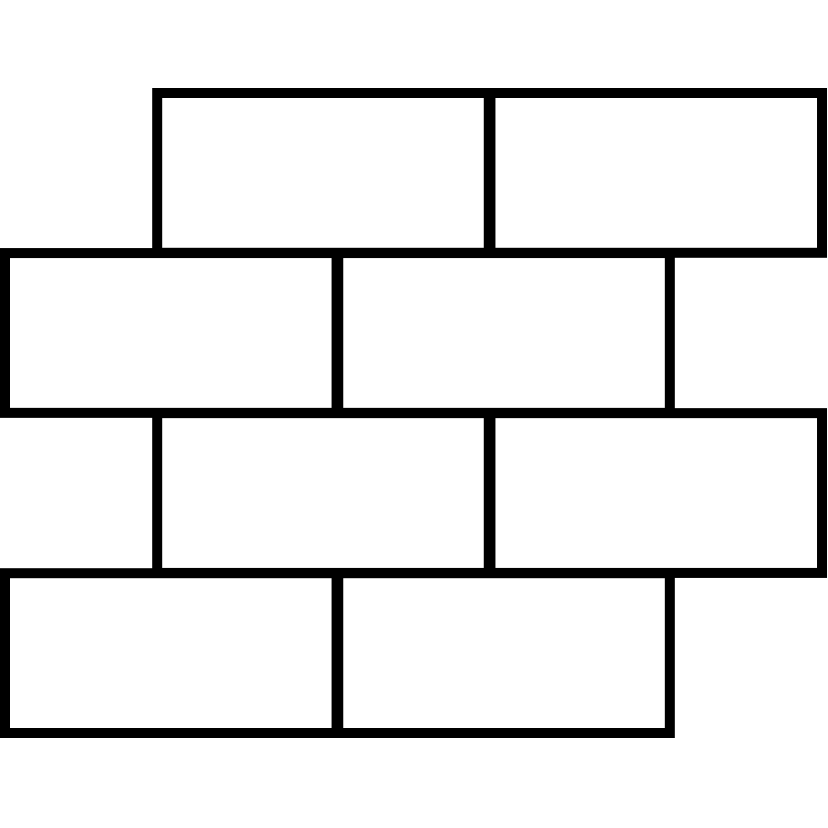
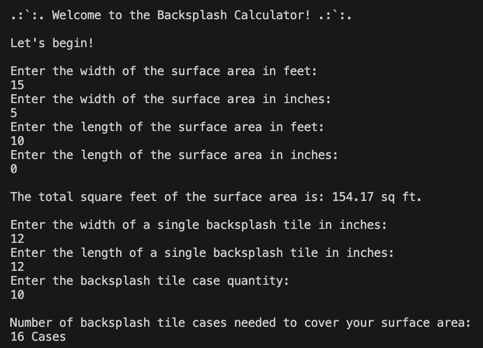
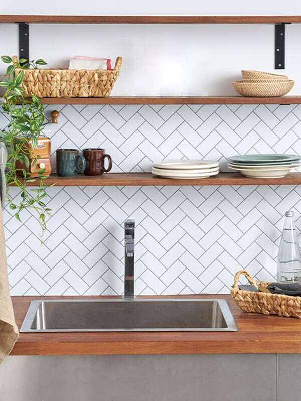
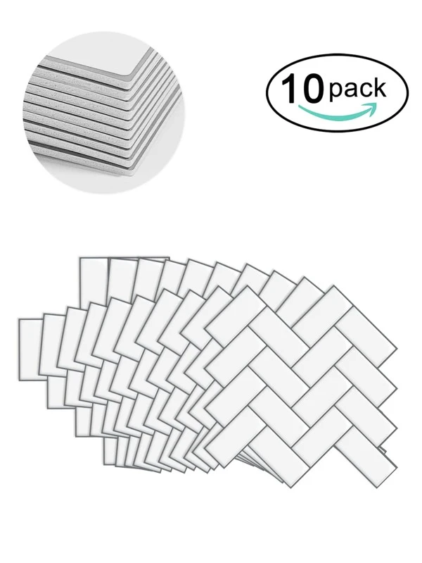
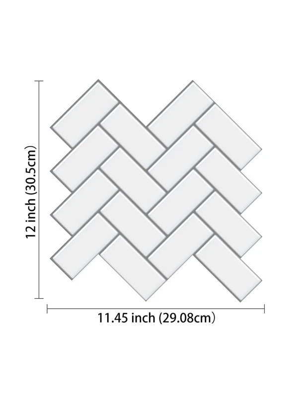

<!-- Begin README -->

<div align="center">
    <a href="https://github.com/scottgriv/java-backsplash_tile_square_footage_calculator" target="_blank">
        
    </a>
</div>
<p align="center">
    <a href="https://www.java.com/en/"></a>
    <br>
    <a href="https://github.com/scottgriv"></a>
    <a href="mailto:scott.grivner@gmail.com"></a>
    <a href="https://www.buymeacoffee.com/scottgriv"></a>
    <br>
    <a href="https://prgportfolio.com" target="_blank"></a>
</p>

---------------

<h1 align="center">📐 Backsplash Tile Square Footage Calculator 📏</h1>

A console based calculator that will assist in determining the number of backsplash tile cases/packs to purchase, based on the square footage using the width and length (in feet and/or inches) of a surface area.

<div align="center">
    <a href="" target="_blank">
        
    </a>
    <br>
    <i>Application Preview</i>
</div>

---------------

## Table of Contents

- [Background Story](#background-story)
- [Getting Started](#getting-started)
    - [Installation](#installation)
    - [Usage](#usage)
- [Resources](#resources)
- [License](#license)
- [Credits](#credits)

## Background Story

I was recently looking to purchase a case of [backsplash floor and wall, peel-and-stick tiles](https://www.homedepot.com/c/localad?auto_locate=true&auto_store=true&flyer_run_id=867085&flyer_type_name=catalog) for a small home project. One problem that I ran into, was that some websites did not have a square footage calculator from my input inches. I wanted to input width and length in inches of my surface area (wall or floor), and get an output for the number of cases that I needed to purchase to cover the surface area of my home project, so I built this Java program to calculate what I needed. Enjoy!

<div align="center">
    
    
    
    
    
</div>

## Getting Started

### Installation

1. Make sure you have Java installed.
2. Download the program files.
3. Open a command line, and navigate to the directory the program is in.
4. Compile the program files by calling: ```javac BacksplashCalculator.java```
5. Run the program by calling: ```java BacksplashCalculator```
6. Follow the program input prompts using the `Program Instructions` below.

### Usage

1. Use a measuring tape to take the dimensions (width & length) of a surface area.
2. Enter the width & length of the surface area in feet and inches (numbers only, no letters). <br>
> [!NOTE]
> If you're measuring the surface area only in feet or inches, input 0 when prompted.
3. Enter the width and length of a single backsplash tile (in inches).
4. Enter the total number of backsplash tiles that come in a single case.
5. The program will calculate the total number of cases you need to purchase to cover your surface area. <br>
> [!NOTE]
> The suggestion may have extra tiles/square footage because we're rounding up to ensure we have enough tiles to cover the input surface area.

## Resources

- [Java](https://www.java.com/en/) - A general-purpose, class-based, object-oriented programming language designed for having lesser implementation dependencies.
- [Java SE Development Kit 8](https://www.oracle.com/java/technologies/javase/javase-jdk8-downloads.html) - The JDK is a development environment for building applications, applets, and components using the Java programming language.
- [Java SE Runtime Environment 8](https://www.oracle.com/java/technologies/javase-jre8-downloads.html) - The JRE is the runtime portion of the software, which is all you need to run it in your Web browser.
- [Java SE 8 Documentation](https://docs.oracle.com/javase/8/docs/api/) - The Java SE 8 API documentation for developers.
- [Java SE 8 Tutorials](https://docs.oracle.com/javase/tutorial/) - The Java Tutorials are practical guides for programmers who want to use the Java programming language to create applications.
- [Java SE 8 API Specification](https://docs.oracle.com/javase/8/docs/api/overview-summary.html) - The Java SE 8 API specification for developers.
- [Java SE 8 Technical Documentation](https://docs.oracle.com/javase/8/) - The Java SE 8 technical documentation for developers.
- [Java SE 8 Release Notes](https://www.oracle.com/java/technologies/javase/8u-relnotes.html) - The Java SE 8 release notes for developers.

## License

This project is released under the terms of the **MIT License**, which permits use, modification, and distribution of the code, subject to the conditions outlined in the license.
- The [MIT License](https://choosealicense.com/licenses/mit/) provides certain freedoms while preserving rights of attribution to the original creators.
- For more details, see the [LICENSE](LICENSE) file in this repository. in this repository.

## Credits

**Author:** [Scott Grivner](https://github.com/scottgriv) <br>
**Email:** [scott.grivner@gmail.com](mailto:scott.grivner@gmail.com) <br>
**Website:** [scottgrivner.dev](https://www.scottgrivner.dev) <br>
**Reference:** [Main Branch](https://github.com/scottgriv/java-backsplash_tile_square_footage_calculator)

---------------

<div align="center">
    <a href="https://github.com/scottgriv" target="_blank">
        
    </a>
</div>

<!-- End README -->
