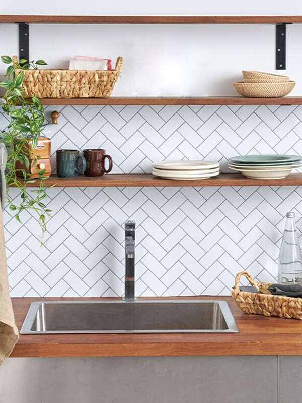
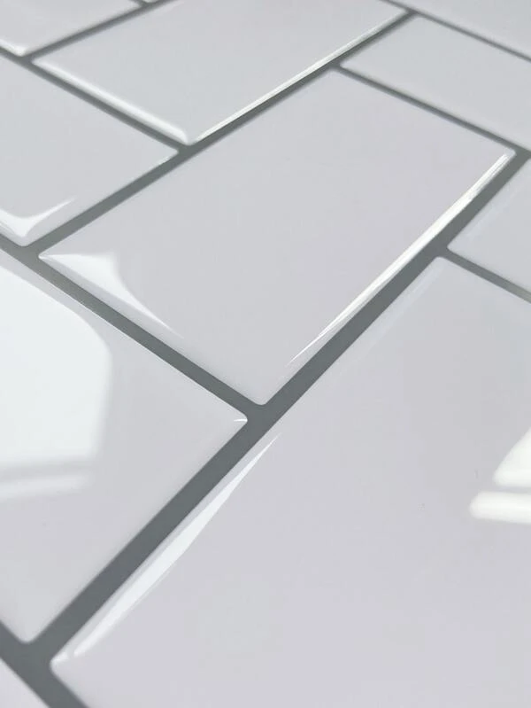
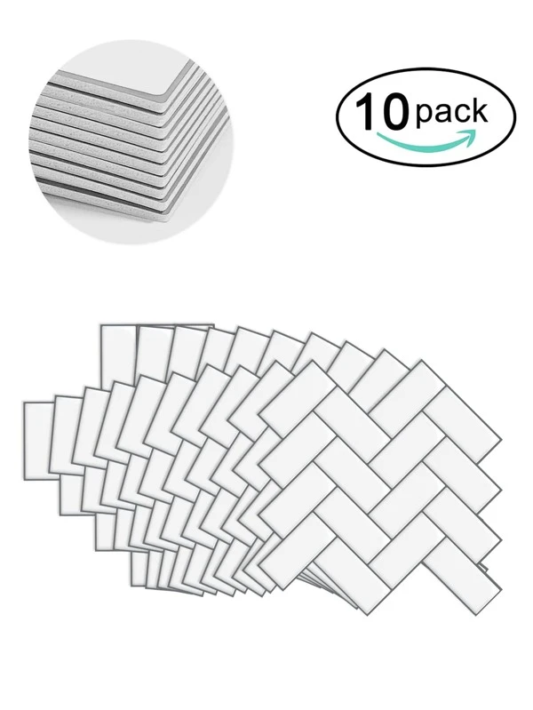
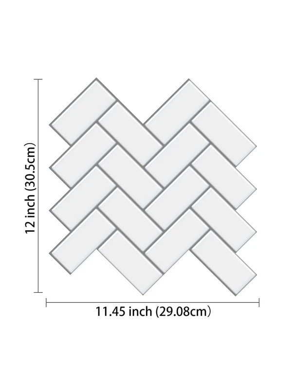
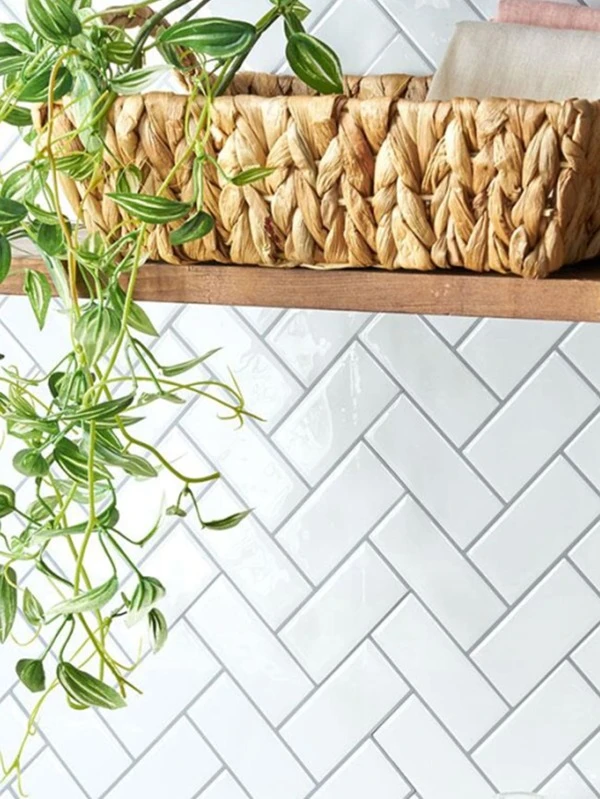

# Backsplash Tile Square Footage Calculator
A calculator that will assist in determining the number of backsplash tile cases/packs to purchase, based on the square footage using the width and length (in feet and/or inches) of a surface area.

## Background
I was recently looking to purchase a case of [backsplash floor and wall, peel-and-stick tiles](https://www.homedepot.com/c/localad?auto_locate=true&auto_store=true&flyer_run_id=867085&flyer_type_name=catalog) for a small home project. One problem that I ran into, was that some websites did not have a square footage calculator from my input inches. I wanted to input width and length in inches of my surface area (wall or floor), and get an output for the number of cases that I needed to purchase to cover the surface area of my home project, so I built this Java program to calculate what I needed. Enjoy!

<div align="center">
    
    
    
    
    
</div>

## Installation Instructions
1. Make sure you have Java installed.
2. Download the program files.
3. Open a command line, and navigate to the directory the program is in.
4. Compile the program files by calling: ```javac BacksplashCalculator.java```
5. Run the program by calling: ```java BacksplashCalculator```
6. Follow the program input prompts using the `Program Instructions` below.

## Program Instructions
1. Use a measuring tape to take the dimensions (width & length) of a surface area.
2. Enter the width & length of the surface area in feet and inches (numbers only, no letters). <br>
**Note:** If you're measuring the surface area only in feet or inches, input 0 when prompted.
3. Enter the width and length of a single backsplash tile (in inches).
4. Enter the total number of backsplash tiles that come in a single case.
5. The program will calculate the total number of cases you need to purchase to cover your surface area. <br>
**Note:** The suggestion may have extra tiles/square footage because we're rounding up to ensure we have enough tiles to cover the input surface area.

## License
This repository is released under the **MIT License**. [See LICENSE](LICENSE) for details.

## Credit
**Author:** [Scott Grivner](https://github.com/scottgriv)<br>
**Email:** scott.grivner@gmail.net<br>
**Website:** [nightowllabs.net](https://www.nightowllabs.net)<br>
**Reference:** [Main Branch](https://github.com/scottgriv/java-backsplash_square_footage_calculator)